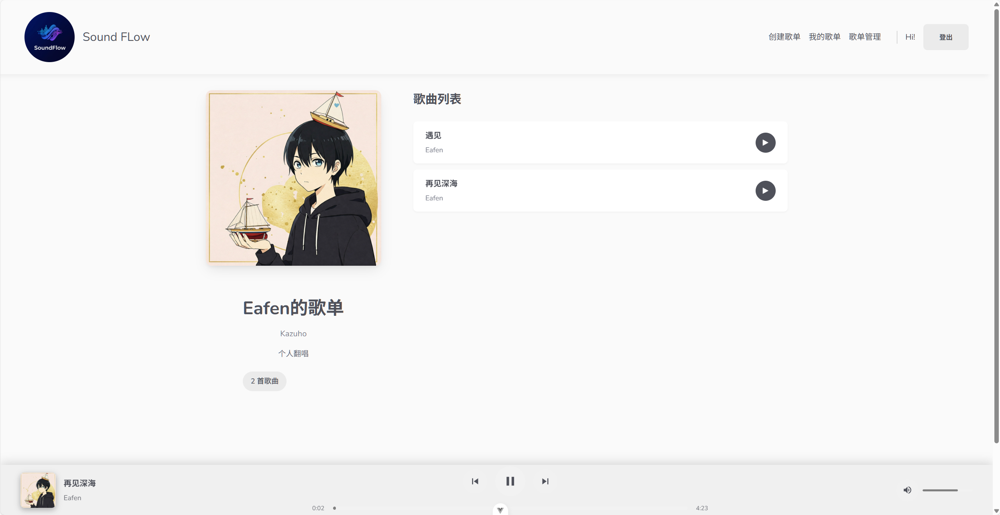

# 🎵 Sound-Flow

> 一个现代化的在线音乐播放平台，让音乐分享变得简单而优雅

[](https://vuejs.org/)
[](https://firebase.google.com/)
[](https://vitejs.dev/)

## ✨ 特色功能

- 🎧 **流畅播放体验** - 支持桌面端和移动端的音乐播放控制
- 📱 **响应式设计** - 完美适配各种设备屏幕
- 🎵 **歌单管理** - 创建、编辑、删除个人歌单
- ☁️ **云端存储** - 基于 Firebase 的安全可靠存储
- 🎨 **现代化界面** - 简洁优雅的用户体验
- 🔐 **用户认证** - 安全的登录注册系统

## 📸 应用截图

### 主页 - 发现音乐


### 歌单详情 - 沉浸式播放



### 歌单管理 - 轻松管理


## 🚀 技术栈

- **前端框架**: Vue 3 + Composition API
- **状态管理**: Pinia
- **路由管理**: Vue Router 4
- **构建工具**: Vite
- **后端服务**: Firebase (Authentication, Firestore, Storage)
- **部署平台**: Firebase Hosting

## 🎯 核心功能

### 🎵 音乐播放

- 支持播放/暂停、上一首/下一首
- 进度条拖拽控制
- 音量调节
- 移动端触摸支持

### 📂 歌单管理

- 创建个人歌单
- 上传音乐文件
- 批量删除歌曲
- 歌单封面自定义

### 👤 用户系统

- 邮箱注册登录
- 个人歌单展示
- 用户权限控制

## 🛠️ 快速开始

### 环境要求

- Node.js 16+
- npm 或 yarn

### 安装依赖

```bash
npm install
```

### 开发环境

```bash
npm run dev
```

### 构建生产版本

```bash
npm run build
```

## 📁 项目结构

```
src/
├── components/          # 组件
│   ├── global/         # 全局组件
│   └── ...
├── views/              # 页面视图
├── stores/             # Pinia 状态管理
├── composables/        # 组合式函数
├── firebase/           # Firebase 配置
└── router/             # 路由配置
```

## 🔧 配置说明

1. 创建 Firebase 项目
2. 配置 Authentication、Firestore、Storage
3. 复制配置到 `src/firebase/config.js`
4. 设置 Firestore 和 Storage 安全规则

## 📄 开源协议

MIT License - 详见 [LICENSE](LICENSE) 文件

## 🤝 贡献

欢迎提交 Issue 和 Pull Request！

---

⭐ 如果这个项目对你有帮助，请给个 Star 支持一下！
